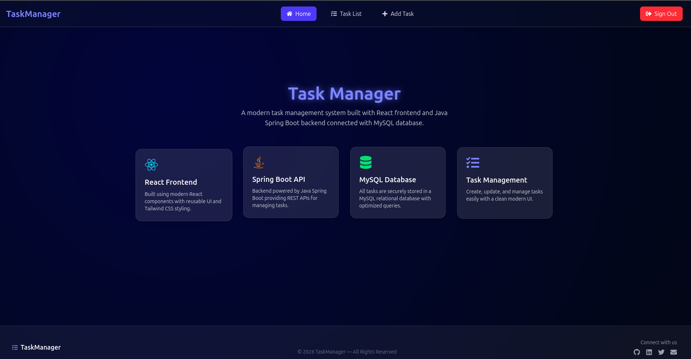

# Task Manager App

A **full-stack Task Manager application** built with **Spring Boot**, **React (Vite)**, and **MySQL**.  
It allows users to create, view, update, delete, and search tasks.

---

## Table of Contents

- [Technologies Used](#technologies-used)  
- [Features](#features)  
- [Project Structure](#project-structure)  
- [Backend Setup](#backend-setup)  
- [Frontend Setup](#frontend-setup)  
- [Database Setup](#database-setup)  
- [API Endpoints](#api-endpoints)  
- [Future Improvements](#future-improvements)  

---

## Technologies Used

- **Backend:** Java 17, Spring Boot, Spring Data JPA, Maven  
- **Frontend:** React, Vite, Tailwind CSS  
- **Database:** MySQL  
- **Tools:** XAMPP (for MySQL & phpMyAdmin), Postman  

---

## Features

- Create, update, delete, and view tasks  
- Search tasks by title  
- Full CRUD REST API  
- React frontend with live updates from backend  

---

## Project Structure
taskmanager/
├── backend/ # Spring Boot backend
│ ├── src/
│ ├── pom.xml
│ └── application.properties
├── frontend/ # React frontend (Vite + Tailwind)
│ ├── src/
│ ├── package.json
│ └── public/
├── database/ # Database schema / seed
│ └── taskdb.sql
├── README.md
└── .gitignore


---

## Backend Setup

1. Open terminal and navigate to `backend/` folder:

```bash
cd backend

```
2. Build the project:

```bash
mvn clean install
```

3. Run the backend server:

```bash
mvn spring-boot:run

Server will start on:

http://localhost:8080

```
---

##
Frontend Setup

1. Navigate to frontend/

```bash
cd frontend
```

2. Install dependencies:

```bash
npm install
```

3. Start the frontend:

```bash
npm run dev

Frontend will be available at:

http://localhost:5173
```
-----

##
Database Setup

1. Install MySQL (or use XAMPP)

2. Open phpMyAdmin

3. Create a new database called taskdb

4. Import the SQL file database/taskdb.sql

5. Update backend/application.properties if your MySQL username/password is different:

```bash
spring.datasource.url=jdbc:mysql://localhost:3306/taskdb
spring.datasource.username=root
spring.datasource.password=yourpassword
```




